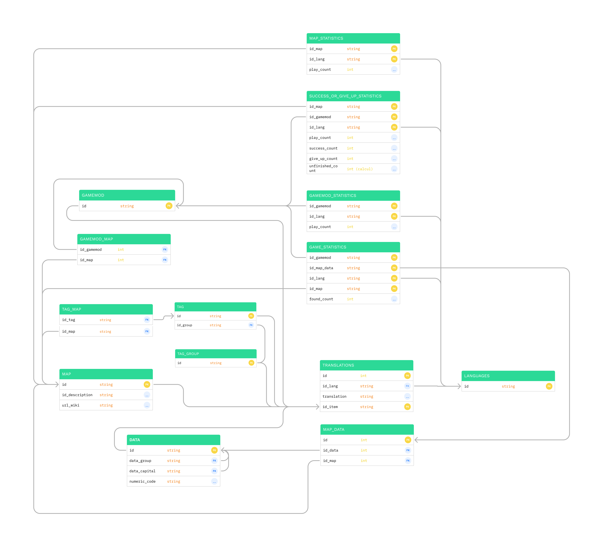

# Database

## Schema



### Table generation script

```sql
CREATE TABLE languages (
    id VARCHAR(50),
    PRIMARY KEY(id)
);

CREATE TABLE translations (
    id SERIAL PRIMARY KEY,
    id_lang VARCHAR(50) REFERENCES languages(id),
    translation text,
    id_item VARCHAR(50)
);

CREATE TABLE map (
    id VARCHAR(50) PRIMARY KEY,
    id_description VARCHAR(50),
    url_wiki  VARCHAR(250)
);

CREATE TABLE tag_group (
    id VARCHAR(50) PRIMARY KEY
);

CREATE TABLE tag (
    id VARCHAR(50) PRIMARY KEY,
    id_group VARCHAR(50) NOT NULL,
    FOREIGN KEY(id_group) REFERENCES tag_group(id)
);

CREATE TABLE tag_map (
    id_map VARCHAR(50) REFERENCES map(id),
    id_tag VARCHAR(50) REFERENCES tag(id),
    PRIMARY KEY(id_map, id_tag)
);

CREATE TABLE gamemod (
    id VARCHAR(50) PRIMARY KEY
);

CREATE TABLE gamemod_map (
    id_gamemod VARCHAR(50) REFERENCES gamemod(id),
    id_map VARCHAR(50) REFERENCES map(id),
    PRIMARY KEY(id_gamemod, id_map)
);

CREATE TABLE data (
    id VARCHAR(50) PRIMARY KEY,
    data_group VARCHAR(50) REFERENCES data(id),
    data_capital VARCHAR(50) REFERENCES data(id),
    numeric_code VARCHAR(50) NOT NULL
);

CREATE TABLE map_data (
    id SERIAL PRIMARY KEY,
    id_data VARCHAR(50) REFERENCES data(id),
    id_map VARCHAR(50) REFERENCES map(id)
);

CREATE TABLE map_statistics (
    id_map VARCHAR(50) REFERENCES map(id),
    id_lang VARCHAR(50) REFERENCES languages(id),
    play_count INT DEFAULT 0,
    PRIMARY KEY(id_map, id_lang)
);

CREATE TABLE gamemod_statistics (
    id_gamemod VARCHAR(50) REFERENCES gamemod(id),
    id_lang VARCHAR(50) REFERENCES languages(id),
    play_count INT DEFAULT 0,
    PRIMARY KEY(id_gamemod, id_lang)
);

CREATE TABLE success_or_give_up_statistics (
    id_map VARCHAR(50) REFERENCES map(id),
    id_gamemod VARCHAR(50) REFERENCES gamemod(id),
    id_lang VARCHAR(50) REFERENCES languages(id),
    play_count INT DEFAULT 0,
    success_count INT DEFAULT 0,
    give_up_count INT DEFAULT 0,
    unfinished_count INT GENERATED ALWAYS AS (play_count - (success_count+give_up_count)) STORED,
    PRIMARY KEY(id_map, id_gamemod, id_lang)
);

CREATE TABLE game_statistics (
    id_gamemod VARCHAR(50) REFERENCES gamemod(id),
    id_map_data INT REFERENCES map_data(id),
    id_lang VARCHAR(50) REFERENCES languages(id),
    id_map VARCHAR(50) REFERENCES map(id),
    found_count INT DEFAULT 0,
    PRIMARY KEY(id_gamemod, id_map_data, id_lang, id_map)
);

```

### Dataset generation script

```sql
INSERT INTO languages (id)
VALUES ('fr-FR');

INSERT INTO tag_group (id)
VALUES  ('TAG_GROUP_CONTINENT'),
        ('TAG_GROUP_COUNTRY'),
        ('TAG_GROUP_ECONOMIC_UNION');

INSERT INTO tag (id,id_group)
VALUES  ('TAG_FRANCE','TAG_GROUP_COUNTRY'),
        ('TAG_JAPAN','TAG_GROUP_COUNTRY'),
        ('TAG_EUROPE','TAG_GROUP_CONTINENT'),
        ('TAG_ASIA','TAG_GROUP_CONTINENT');

INSERT INTO map (id, id_description, url_wiki)
VALUES  ('FRANCE_DEPARTMENT', "DESCRIPTION_FRANCE_DEPARTMENT", ""),
        ('JAPAN_PREFECTURES', "DESCRIPTION_JAPAN", "");

INSERT INTO map_statistics (id_map, id_lang, play_count)
VALUES ('FRANCE_DEPARTMENT', "fr-FR", 700);

INSERT INTO translations (id, id_lang, translation, id_item)
VALUES  (1,'fr-FR', "France", "TAG_FRANCE"),
        (2,'fr-FR', "Japon", "TAG_JAPAN"),
        (3,'fr-FR', "Europe", "TAG_EUROPE"),
        (4,'fr-FR', "Asie", "TAG_ASIA"),
        (5,'fr-FR', "Continent", "TAG_GROUP_CONTINENT"),
        (6,'fr-FR', "Pays", "TAG_GROUP_COUNTRY"),
        (7,'fr-FR', "france - Départements", "FRANCE_DEPARTMENT"),
        (8,'fr-FR', "Japon - Préfectures", "JAPAN_PREFECTURES"),
        (9,'fr-FR', "Départements de france", "DESCRIPTION_FRANCE_DEPARTMENT"),
        (6,'fr-FR', "Préfectures du japon", "DESCRIPTION_JAPAN");


INSERT INTO tag_map (id_map, id_tag)
VALUES  ("FRANCE_DEPARTMENT","TAG_FRANCE"),
        ("FRANCE_DEPARTMENT","TAG_EUROPE");
```