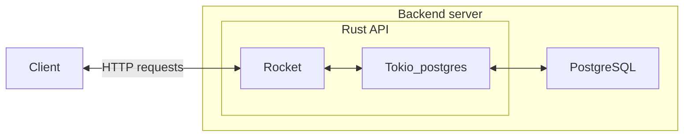

# Backend

This page is about technologies used in the backend of our app and how they communicates.

## Backend global architecture

<!-- ## Host server -->
<!-- @TODO define production server -->

## Rust Techstack

For our backend, we're using Rust.

Rust has a lot of great library to create fast and reliable backend server API.

For this project, we're using the following :

|Logo|Description|
|-|-|
||[Diesel](https://tokio.rs/) is on of the most popular asynchronous environment implementation for Rust. It is widly implemented in many other library (Rocket uses tokio). More specifically, for the database queries, we used [tokio_postgres](https://docs.rs/tokio-postgres/latest/tokio_postgres/). [Github](https://github.com/sfackler/rust-postgres)
||[Rocket](https://rocket.rs/) is a web framework that allows to write backend REST endpoints easily. [Github](https://github.com/SergioBenitez/Rocket)

## Database - Postgres

### Why postgres ?

Quite honestly, it could have been MariaDB, SQLite or any sql like database, it would have been fine. It wouldn't have had a meaningfull impact.

### Why SQL ?

The main reason is that SQL is mastered by the members of the team. Going towards nosql would have no meaningful impact due to the low ambitions that this website has.

### Sources
- [PostgreSQL specificity](https://www.postgresql.org/about/)
- [More on sql vs nosql](https://www.mongodb.com/compare/mongodb-postgresql)

## Why not using an ORM in rust ?

We investigated an ORM, [Diesel](https://diesel.rs/), to see if it could fit our needs. But, in the end, we didn't for the following reasons :

- We have weak coupling on table translations, which is not standard (standard is using foreing keys to enforce integrity)
- Some requests uses special operators that are unnecesseraly hard to implements for our needs. Such as `string_agg` or `coalesc`
- We have quite complexe requests with sub-select and other things.

Using a more classic raw sql executor (with prepared request to prevent SQL Injections) allows us to switch some things, encouraging us to think about performance. We decided to take full usage of SBD capabilities with indexed, view, procedures and functions.