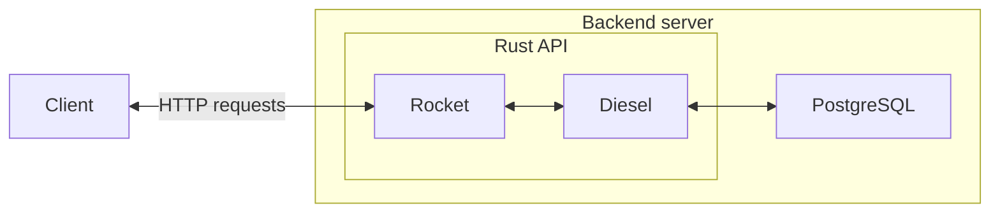

# Backend

This page is about technologies used in the backend of our app and how they communicates.

## Backend global architecture

<!-- ## Host server -->
<!-- @TODO define production server -->

## Rust Techstack

For our backend, we're using Rust.

Rust has a lot of great library to create fast and reliable backend server API.

For this project, we're using the following :

|Logo|Description|
|-|-|
||[Diesel](https://diesel.rs/) is an ORM (Object Relational Mapping) library that allows simple (through library api) and secure (through automatic argument parsing) requests to SQL databases such as Postgres, MySQL and SQLite. <!-- link to github source code for this -->|
||[Rocket](https://rocket.rs/) is a web framework that allows to write backend REST endpoints easily. <!-- link to github source code for this -->|

## Database - Postgres

### Why postgres ?

Quite honestly, it could have been MariaDB, SQLite or any sql like database, it would have been fine. It wouldn't have had a meaningfull impact.

### Why SQL ?

The main reason is that SQL is mastered by the members of the team. Going towards nosql would have no meaningful impact due to the low ambitions that this website has.

### Sources
- [PostgreSQL specificity](https://www.postgresql.org/about/)
- [More on sql vs nosql](https://www.mongodb.com/compare/mongodb-postgresql)