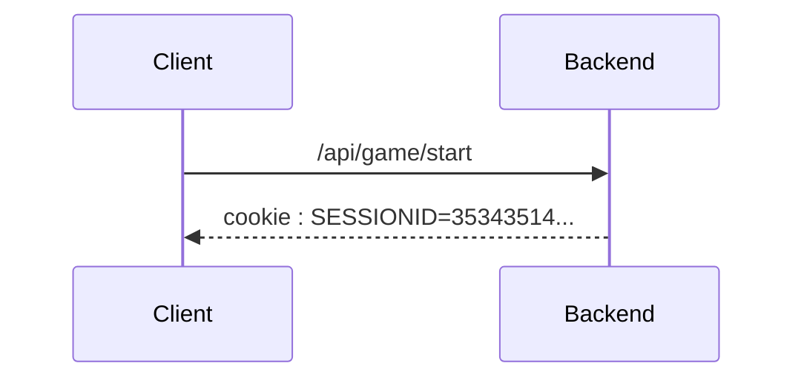

# Game endpoints

<style>.scheme-container{display:none;}</style>

!!swagger game.yaml!!

## Sequence diagram



<!-- @TODO create sequence diagram or sth

Séquence de traitements backend particuliers :
- Une requête arrive, elle a une id de session (si l’utilisateur envoie un cookie, c’est forcément qu’il est encore dans les temps, puisque max-age. mais dans le cas où il modifirait le max age, si il est après la durée max de la partie, alors on renvoie un 400)
- La session est récupéré
- On vérifie que pour la partie associée à la session, les temps semblent correct pour ne pas être de la triche
- En fonction de si les temps sont corrects, deux cas :
    - réponse 200 si correct
    - réponse 400 si incorrect, le frontend doit indiquer au joueur qu’il est suspecté de triche et que donc les données anonymisées ne seront pas sauvegarder
- si correct, alors on enregistre les données statistiques en bases
- Quoi qu’il arrive on ferme la session et on nettoie. -->
<!-- @TODO create sequence diagram or sth
Séquence de traitements backend particuliers :

- Une requête arrive, elle a une id de session
- La session est récupéré
- La réponse (au sens de réponse au jeu) est comparé avec ce qu’il est possible de trouver sur le jeu/carte et ce qui a déjà été trouvé. 3 cas
- la réponse est bien une nouvelle réponse :  200 OK
- la réponse a déjà été trouvé :  400 BAD REQUEST
- la réponse est fausse :  400 BAD REQUEST
- [voir comment gérer le timestamp et la triche]
- La réponse approprié est renvoyé au client -->

<!-- 
Comments :
Une énum GameResponse est à réfléchir pour déterminer les réponses possible d’erreur prévues. Cette énum pourrait prendre les valeurs suivantes : OK, ALREADY_FOUND, WRONG_GUESS, UNKNOWN_ERROR
 -->
## Typescript schema

### Save entry

```ts
interface SaveEntryStatus{
   reponsecode : GameResponse
}

enum GameResponse {
    OK=1,
    ALREADY_FOUND=2,
    WRONG_GUESS=3,
    UNKNOWN_ERROR=4
}
```

#### Example
```json
{
   "reponsecode" : 1
}
```


## Associated SQL Request

### Give up

```sql
UPDATE success_or_give_up_statistics
SET play_count = play_count + 1, give_up_count = give_up_count +1
WHERE id_map = :MAP_ID
AND id_gamemode = :GAMEMODE_ID
AND lang_id = :LANG_ID;

UPDATE map_statistics
SET play_count = play_count + 1
WHERE id_map = :MAP_ID
AND lang_id = :LANG_ID;

UPDATE gamemode_statistics
SET play_count = play_count + 1
WHERE id_gamemode = :GAMEMODE_ID
AND lang_id = :LANG_ID;

UPDATE game_statistics
SET found_count = found_count + 1
WHERE  id_map = :MAP_ID
AND id_gamemode = :GAMEMODE_ID
AND lang_id = :LANG_ID
AND id_map_data = :ID_MAP_DATA;
```

### End game

```sql
UPDATE map_statistics
SET play_count = play_count + 1
WHERE id_map = :ID_MAP
AND id_lang = :ID_LANG;

UPDATE gamemode_statistics
SET play_count = play_count + 1
WHERE id_map = :ID_MAP
AND id_lang = :ID_LANG;

UPDATE game_statistics
SET found_count = found_count + 1
WHERE id_gamemode = :ID_GAMEMODE
AND id_lang = :ID_LANG
AND id_map = :ID_MAP
AND id_map_data IN(:ID_MAP_DATA, "FR_01", "FR_02", ...);

UPDATE success_or_give_up_statistics
SET play_count = play_count + 1
WHERE id_gamemode = :ID_GAMEMODE
AND id_lang = :ID_LANG
AND id_map = :ID_MAP;
```
