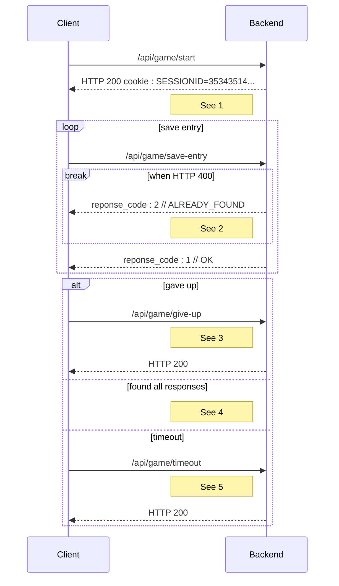

# Game endpoints

<style>.scheme-container{display:none;}</style>

!!swagger game.yaml!!

## Game scenarion - Sequence diagram



1. Every following message will have the cookie header SESSIONID.
2. The client computed something wrong.Theserver detected it.The client willstop the game and display a message.The server will generate a log for the devs with all session information(expect sensitive data such as IP).
4. The client wants to stop the game. The server saves statistics.
5. If the client found all responses. It displays the "win" page and the server automatically saves statistics.
6. The client didn't finished before the timeout. The server saves statistics.

Note :

- For a game creation, the sessions' cookie is instanciated throuh `SET-COOKIE` HTTP header.
- Session cookies will have the following propertiers by default :<br>[`Secure : true`, `HttpOnly : true`](https://developer.mozilla.org/en-US/docs/Web/HTTP/Cookies#restrict_access_to_cookies),  and [`SameSite : strict`](https://developer.mozilla.org/en-US/docs/Web/HTTP/Headers/Set-Cookie/SameSite).
- The generated cookie will have a `Max-Age` of the duration of the game + 5seconds to mitigate timing issue between end of the game and effective end request.
- If the server does not receive any client request before 1 minute after the game should have ended, then end session and does not save statisics.
- If the player tries to quit the page normally, an alert tells him that doing so will be considered as giving up, and a `give-up` request will be sent.

<!-- @TODO create sequence diagram or sth

Séquence de traitements backend particuliers :
- Une requête arrive, elle a une id de session (si l’utilisateur envoie un cookie, c’est forcément qu’il est encore dans les temps, puisque max-age. mais dans le cas où il modifirait le max age, si il est après la durée max de la partie, alors on renvoie un 400)
- La session est récupéré
- On vérifie que pour la partie associée à la session, les temps semblent correct pour ne pas être de la triche
- En fonction de si les temps sont corrects, deux cas :
    - réponse 200 si correct
    - réponse 400 si incorrect, le frontend doit indiquer au joueur qu’il est suspecté de triche et que donc les données anonymisées ne seront pas sauvegarder
- si correct, alors on enregistre les données statistiques en bases
- Quoi qu’il arrive on ferme la session et on nettoie. -->

## Typescript schema

### Game list - Response

```ts
/**
 * A an array of json objects representing a game id and its popularity
 */
interface Game {
  /**
   * The id of the gamemod
   */
  id_gamemod:string,
  /**
   * The number of time the gamemod was played
   */
  play_count: number
}
```

#### Example

```json
[
  {
    "id_gamemod": "AGAINST_CLOCK",
    "play_count": 0
  }
]
```

#### Associated SQL request

```sql
CREATE VIEW game_list AS
    SELECT g.id, COALESCE(gs.play_count,0) as play_count
    FROM gamemod g 
    LEFT JOIN gamemod_statistic gs
    ON g.id = gs. id_gamemod;

SELECT * FROM game_list;
```

### Start - Request

```ts
/**
 * A json object representing what map the player will be playing on, and what game it is
 */
interface StartGameRequest {
  /**
   * The id of the map 
   */
  id_map:string,
  /**
   * The id of the gamemod
   */
  id_gamemod:string
}
```

#### Example

```json
{
  "id_map": "FRANCE_DEPARTMENTS",
  "id_gamemod": "AGAINST_THE_CLOCK"
}
```

### Save entry - Request

```ts
/**
 * A json object representing the player's answer.
 */
interface SaveEntryRequest {
  /**
   * The player's answer
   */
  response: string,
  /**
   * The data's id supposedly associated
   */
  supposedCorrespondance: string
}

```

#### Example

```json
{
  "response": "loire atlantique",
  "supposedCorrespondance": "FR-44"
}
```

### Save entry - Response

```ts
/**
 * What the server concludes with the given answer. 
 */
interface SaveEntryResponse {
  reponse_code: GameResponse;
}

enum GameResponse {
  OK = 1,
  ALREADY_FOUND = 2,
  WRONG_GUESS = 3,
  UNKNOWN_ERROR = 4,
}
```

#### Example

```json
{
  "reponsecode": 1
}
```

## Associated SQL Request

### Statistics on end game

```sql
UPDATE map_statistics
SET play_count = play_count + 1
WHERE id_map = :ID_MAP
AND id_lang = :ID_LANG;

UPDATE gamemod_statistics
SET play_count = play_count + 1
WHERE id_map = :ID_MAP
AND id_lang = :ID_LANG;

UPDATE success_or_give_up_statistics
SET play_count = play_count + 1
WHERE id_gamemod = :ID_GAMEMOD
AND id_lang = :ID_LANG
AND id_map = :ID_MAP;

UPDATE game_statistics
SET found_count = found_count + 1
WHERE id_map = :ID_MAP
AND id_gamemod = :ID_GAMEMOD
AND id_lang = :ID_LANG
AND id_map_data IN(:ID_MAP_DATA, "FR_01", "FR_02", ...);
```