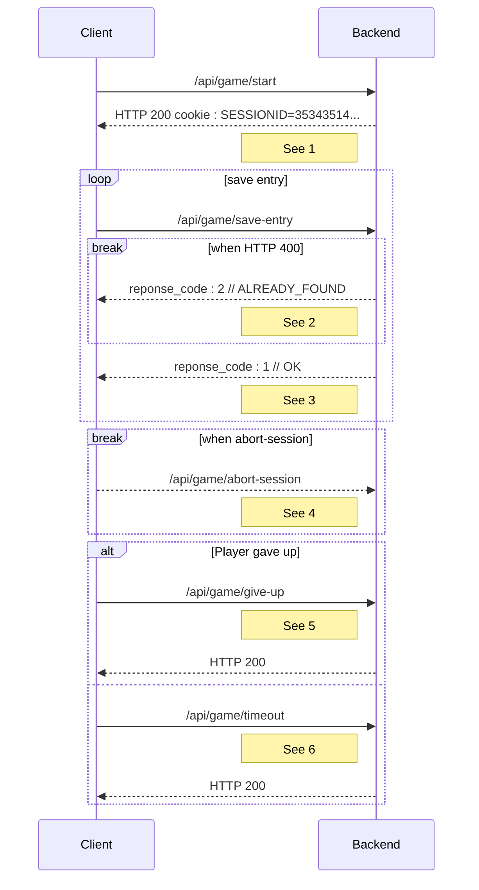

# Game endpoints

<style>.scheme-container{display:none;}</style>

!!swagger game.yaml!!

## Sequence diagram



1. Every following message will have the cookie header SESSIONID.
2. The client computed something wrong.Theserver detected it.The client willstop the game and display a message.The server will generate a log forthe devs with all session information(expect sensitive data such as IP).
3. If the client found all responses. It displays the "win" page and the server automatically saves statistics.
4. The client hard quit the page.
5. The client wants to stop the game.
6. The client didn't finished before the timeout.

<!-- @TODO create sequence diagram or sth

Séquence de traitements backend particuliers :
- Une requête arrive, elle a une id de session (si l’utilisateur envoie un cookie, c’est forcément qu’il est encore dans les temps, puisque max-age. mais dans le cas où il modifirait le max age, si il est après la durée max de la partie, alors on renvoie un 400)
- La session est récupéré
- On vérifie que pour la partie associée à la session, les temps semblent correct pour ne pas être de la triche
- En fonction de si les temps sont corrects, deux cas :
    - réponse 200 si correct
    - réponse 400 si incorrect, le frontend doit indiquer au joueur qu’il est suspecté de triche et que donc les données anonymisées ne seront pas sauvegarder
- si correct, alors on enregistre les données statistiques en bases
- Quoi qu’il arrive on ferme la session et on nettoie. -->

## Typescript schema

### Save entry

```ts
interface SaveEntryStatus {
    reponse_code: GameResponse;
}

enum GameResponse {
    OK = 1,
    ALREADY_FOUND = 2,
    WRONG_GUESS = 3,
    UNKNOWN_ERROR = 4,
}
```

#### Example

```json
{
    "reponsecode": 1
}
```

## Associated SQL Request

### Give up

```sql
UPDATE success_or_give_up_statistics
SET play_count = play_count + 1, give_up_count = give_up_count +1
WHERE id_map = :MAP_ID
AND id_gamemode = :GAMEMODE_ID
AND lang_id = :LANG_ID;

UPDATE map_statistics
SET play_count = play_count + 1
WHERE id_map = :MAP_ID
AND lang_id = :LANG_ID;

UPDATE gamemode_statistics
SET play_count = play_count + 1
WHERE id_gamemode = :GAMEMODE_ID
AND lang_id = :LANG_ID;

UPDATE game_statistics
SET found_count = found_count + 1
WHERE  id_map = :MAP_ID
AND id_gamemode = :GAMEMODE_ID
AND lang_id = :LANG_ID
AND id_map_data = :ID_MAP_DATA;
```

### End game

```sql
UPDATE map_statistics
SET play_count = play_count + 1
WHERE id_map = :ID_MAP
AND id_lang = :ID_LANG;

UPDATE gamemode_statistics
SET play_count = play_count + 1
WHERE id_map = :ID_MAP
AND id_lang = :ID_LANG;

UPDATE game_statistics
SET found_count = found_count + 1
WHERE id_gamemode = :ID_GAMEMODE
AND id_lang = :ID_LANG
AND id_map = :ID_MAP
AND id_map_data IN(:ID_MAP_DATA, "FR_01", "FR_02", ...);

UPDATE success_or_give_up_statistics
SET play_count = play_count + 1
WHERE id_gamemode = :ID_GAMEMODE
AND id_lang = :ID_LANG
AND id_map = :ID_MAP;
```
