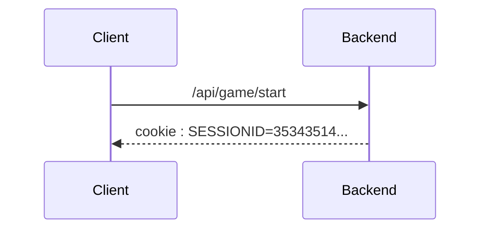

# Game endpoints

<style>.scheme-container{display:none;}</style>

!!swagger index.yaml!!

## Sequence diagram



## Typescript schema

### Save entry

```ts
interface SaveEntryStatus{
   reponsecode : GameResponse
}

enum GameResponse {
    OK=1,
    ALREADY_FOUND=2,
    WRONG_GUESS=3,
    UNKNOWN_ERROR=4
}
```

#### Example
```json
{
   "reponsecode" : 1
}
```


## Associated SQL Request

### Give up

```sql
UPDATE success_or_give_up_statistics
SET play_count = play_count + 1, give_up_count = give_up_count +1
WHERE id_map = :MAP_ID
AND id_gamemode = :GAMEMODE_ID
AND lang_id = :LANG_ID;

UPDATE map_statistics
SET play_count = play_count + 1
WHERE id_map = :MAP_ID
AND lang_id = :LANG_ID;

UPDATE gamemode_statistics
SET play_count = play_count + 1
WHERE id_gamemode = :GAMEMODE_ID
AND lang_id = :LANG_ID;

UPDATE game_statistics
SET found_count = found_count + 1
WHERE  id_map = :MAP_ID
AND id_gamemode = :GAMEMODE_ID
AND lang_id = :LANG_ID
AND id_map_data = :ID_MAP_DATA;
```

### End game

```sql
UPDATE map_statistics
SET play_count = play_count + 1
WHERE id_map = :ID_MAP
AND id_lang = :ID_LANG;

UPDATE gamemode_statistics
SET play_count = play_count + 1
WHERE id_map = :ID_MAP
AND id_lang = :ID_LANG;

UPDATE game_statistics
SET found_count = found_count + 1
WHERE id_gamemode = :ID_GAMEMODE
AND id_lang = :ID_LANG
AND id_map = :ID_MAP
AND id_map_data IN(:ID_MAP_DATA, "FR_01", "FR_02", ...);

UPDATE success_or_give_up_statistics
SET play_count = play_count + 1
WHERE id_gamemode = :ID_GAMEMODE
AND id_lang = :ID_LANG
AND id_map = :ID_MAP;
```
