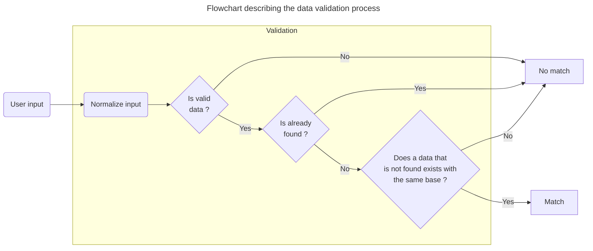
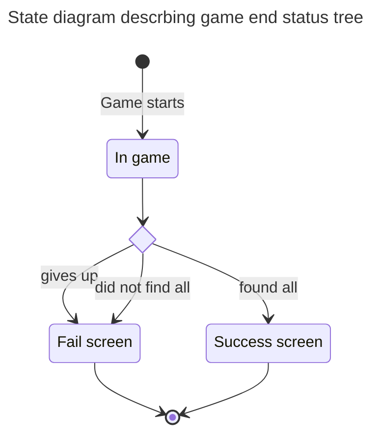

# Games

On this page, you will have more hindsights on the games we implemented or want to implement.

## Discussion on games

Wanderways revolves around games to learn maps. But, choosing and defining what is good or not can be quite difficult. Here is a short description of the game that are planned for V1.

- Against the clock : There is a map and a timer displayed. The player must type as fast as they can the geographical datas relative to the map they are on.
- Quizz : Could be of many types. Adapted to learn flags, but also another mean to learn maps. Could also be a funny quizz with exotic questions.

To parralel this method with other :

|Method|Benefits↗|Flaws↘|
||-|-|
|Tapping|- Teaches countries spelling. - Teaches countries neighbours (useful to understand geopolitical issues) - Ordered learning. You can go the way you want, beginning with south africa, going upwards the west coast ? That's your choice. - Challenging (can be good depending on the user)|- Hard, you need to be determined. Though, maps can be splitted in sub-regions, making it more friendly. - **Unfit for mobile devices** - How to deal with close names ? E.g : "Loire" and "Loiret"|
|Quizz|- If you don't know, you've got 25% chance of randomly be right. - Beginner friendly|- Player doesn't learn what neighbours a country has. - Unordered learning|
|User pin|- Good location memorisation |- Player doesn't learn what neighbours a country has. - Unordered learning|

***Quizz guided method - A short description***

The user has a map displayed. A country gets colored. 4 cards appear, each containing a potential answer. The user has to choose which one corresponds to the colored country.

***User pin on the map method - A short description***

The user has a map displayed. A country name appears. The user has to click on the map at the location where they think the country is located at.

## Against the clock

This is the main game of Wanderways.

A map, a text input, a list of found responses, a timer and a progress bar are displayed.

### Rules

- Once the game starts, the timer cannot be stopped.
- A give-up button allows the player to quit early.
- Leaving the page is considered giving-up (if page unload event caught normally).

### Technical details and point of interest

#### How do you know the user's answer is good ?

A user answer is good as long as it matches one of the data in the data list.

If only it was that easy. Let's see what triggers data validation and list special cases.

A data validation process is triggered when a user tap a character in the input. That's the only thing that trigger validation.

Now, let's see what could go wrong :

- A data can have accentuated character (diacritics) depending on the language : `Côte d'or`. Though, depending on the keyboard, they can be quite complicated to perform.
- A sequence of character can match a data too early. E.g : `Loire` and `Loiret`. You wanted to type `Loiret` and it instantly validates `Loire`. Well, that's okay. But now we don't want it to tell us `data already found` when we type `loire` to then tap `Loiret`
- A data can have multiple names. Such as `Birmanie`, also known as `Myanmar` in french.

So, let's schematize !

Details :

- `Normalize input` means going from `Côte d'or` to `cote-d-or`. This normalization process is also applied to all the data that we compare to.
- `Is valid data` does multiples loops. The main on all data, then on each data translations.

#### How do we know which kind of end the player reached ?

### Concerns about cheating

We can't stop player from having a list of data open in another window. That's a fact, there is no point fighting it.

But, we want to stop people that would try to bypass normal rules of typing to finish the game quicker than humanly possible.

The first thing is to ensure that the control on the game isn't client sided. All along the game, when a good response (evaluated by the client) is found, it is send to the server for validation. The server has the autorithy on wether or not the data was valid, and if the game has ended or not.

But a player could still automate calls to send X requests for each data in a loop. Protection against that is achieved through average time between key stroke verification. If on the total number of data, we find that the user typed faster than the work record, then it will be considered cheating and won't be stored as statistics of any kind.

### Design

#### Zonning

  
Map

  

    <input type="text" placeholder="User responses">
  

  

    Timer
    Current score  / max score
    <button>Give up</button>
    

      Result list
      
Result line 1

      
Result line 2

      
Result line 3

      
Result line 4

      
Result line 5

    

  

*Note : Does not correspond to final game zonnning, this is for visualization purpose*

#### Mockups

More on mockup on [frontend section](@TODO)

Latest version : 

Old versions :

*One of the very first versions, when the project was named "Learn your maps"*

